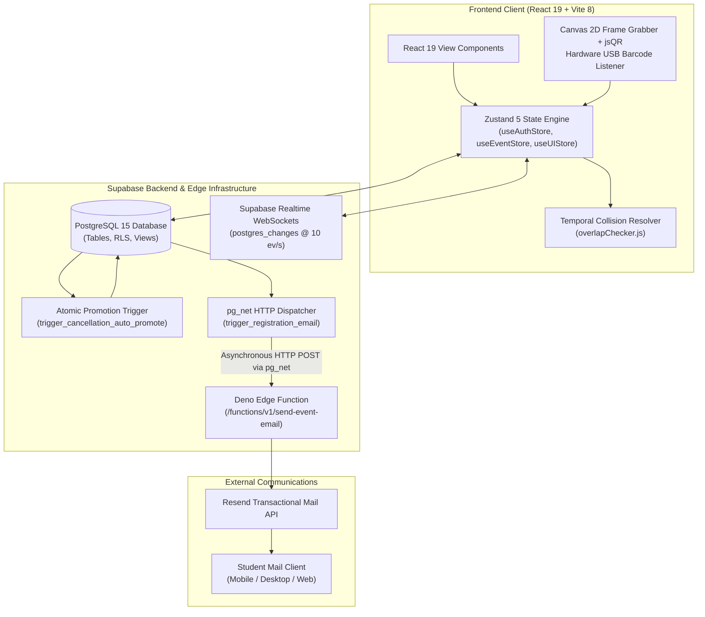
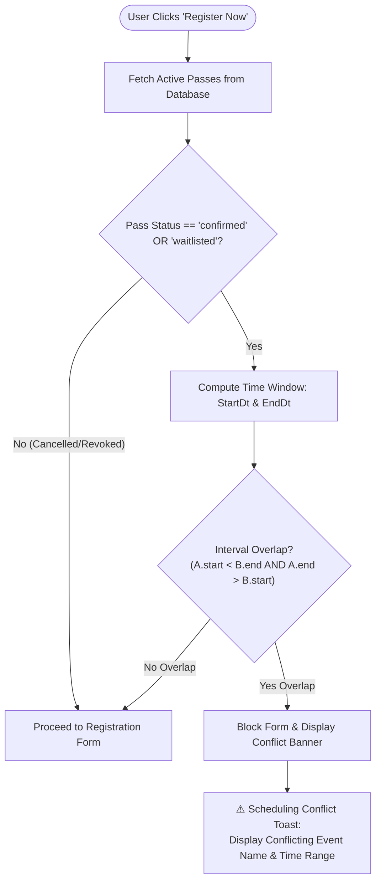
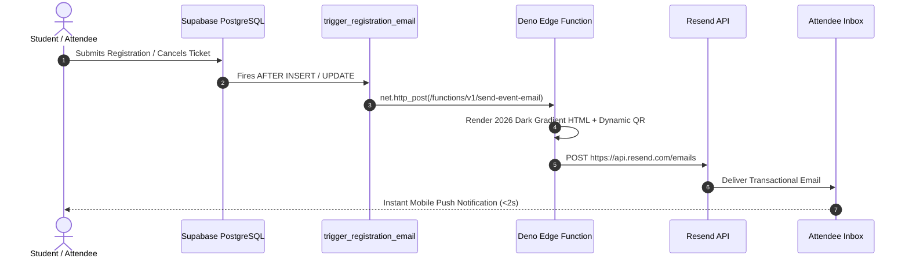
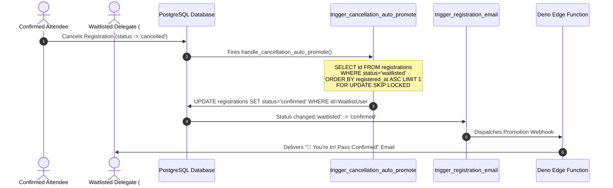

# 🎟️ VibeVenue — Next-Gen Event Management & Gate Operations Suite

<div align="center">

-6366F1?style=for-the-badge&logo=git&logoColor=white)


<br/>

**Production Deployment:** [https://vibe-venue.vercel.app](https://vibe-venue.vercel.app)  
**Author & Lead Architect:** Adithyen H  
**Current Release:** `v0.93 (93 commits)`

</div>

---

## 🌟 Executive Overview

**VibeVenue** is an ultra-fast, 2026-level Event Management, Attendee Verification, and Gate Operations Suite engineered for collegiate hackathons, academic summits, technical symposiums, and sports championships.

Built to eliminate long entry queues and administrative friction, VibeVenue combines **React 19**, **Vite 8**, **Supabase PostgreSQL with Realtime WebSockets**, **Deno Edge Functions**, and **Zero-Latency Canvas 2D QR & Hardware USB Barcode Gun Decoders**. Whether managing single keynote halls or 1,000+ delegate multi-track tournaments, VibeVenue synchronizes registrations, waitlists, turnout metrics, and gate passes across multiple physical desks in real time.

---

## 📸 Visual Showcase & Screen Recordings

Here is a curated visual walkthrough of VibeVenue in action, demonstrating live gate scanning, automated transactional emails, scheduling conflict prevention, and waitlist queuing:

| Live Screen / Capability | Preview & Media Asset | Description |
| :--- | :---: | :--- |
| **60 FPS Gate Scanner & Audio Feedback** | [Check in Scanner.mp4](images/Check%20in%20Scanner.mp4) | Direct Canvas 2D frame sampler decoding QR passes at 60 FPS with hardware barcode listeners. |
| **Confirmed Ticket Pass Email** |  | Transactional pass delivered via Resend with dynamic scannable QR ticket badge. |
| **Waitlist Queue Advancement Email** |  | Automatic notification sent when attendee moves up in line (`#2 ➔ #1`) with updated QR code. |
| **Registration Cancellation Notice** |  | Instant revocation receipt notifying attendee that their seat was released to the waitlist. |
| **Prevent Overlapping Registrations** |  | High-contrast warning banner blocking collision when registering for simultaneous events. |
| **Registration Windows & Spot Settings** |  | Fine-grained deadline configuration for online admission and on-desk spot walk-in passes. |
| **Waitlist & Promotion Telemetry** |  | Deno Edge Function metrics showing 59 invocations, 0% errors, and 159ms average execution. |
| **Digital Pass Wallet (Web Portal)** |  | Student portal showing active digital pass with live gate QR code and schedule coordinates. |
| **Waitlist Pass State (Portal)** |  | Transparent queue position badge (`#1 in Queue`) with auto-upgrade guarantee upon cancellation. |
| **Dynamic UPI Payment & Proof Desk** | .png) | Dynamic UPI QR code generator (`adityenh@oksbi`), UTR reference capture, and receipt uploader. |
| **Event Add-ons & Quota Architect** |  | Supabase relational table editor showing multi-tier passes, merchandise kits, and quotas. |
| **Multi-Step Event Creation Wizard** |  | 4-step event specification builder with banner upload, schedule, pricing, and resource links. |

---

## 🏗️ System Architecture & Framework Rationale



### Why These Specific Technologies?

1. **React 19 (`v19.2.8`) & Vite 8 (`v8.2.0`)**:
   - *Why React 19?* Automatic reconciliation and compilation improvements render complex SVG QR codes and nested team rosters with zero lag. Action transitions provide smooth optimistic updates during gate check-in.
   - *Why Vite 8?* Generates ultra-lean production bundles that load in under 400ms on campus Wi-Fi networks, while providing sub-second HMR during development.
   - *Why not Next.js?* VibeVenue is an authenticated single-page administrative console and high-speed scanner terminal. Server-side rendering adds cold starts and complexity to video camera pipelines and WebSocket streams. An SPA architecture delivers consistent 60 FPS scanning.
2. **Zustand 5 (`v5.0.15`)**:
   - *Why not Redux Toolkit or React Context?* Zustand weighs under 1.2 kB, has zero boilerplate, and allows components to subscribe only to specific attendee rows. High-speed USB barcode scanner input streams update local buffers directly without re-rendering entire page trees.
3. **Vanilla CSS with Custom Design Tokens (Zero Tailwind)**:
   - *Why avoid Tailwind?* Pre-packaged utility frameworks often lead to cookie-cutter layouts. VibeVenue uses a custom 2026-level glassmorphic design token system with native CSS custom properties, hardware-accelerated `backdrop-filter: blur(20px)`, and subtle glowing borders.
4. **Supabase PostgreSQL 15 & Realtime WebSockets**:
   - Relational integrity is paramount for academic summits. Atomic SQL triggers and foreign keys guarantee that seat quotas and waitlist positions are never duplicated. Supabase Realtime propagates check-in status across multiple gate laptops in under 50 milliseconds.
5. **Deno Edge Functions & Resend API**:
   - Supabase Edge Functions spin up in less than 10 milliseconds (V8 isolates), immediately formatting responsive HTML dark-mode emails and dispatching them via Resend with dynamic scannable QR ticket badges.

---

## 🔐 Credentials for Verification & Testing

### 👑 1. Organizer & Admin Portals (3 Accounts)
| Role | Email | Password | Access Rights |
| :--- | :--- | :--- | :--- |
| **Lead Organizer Admin** | `organizer.admin@vibevenue.tech` | `VibeVenueAdmin#2026` | Root Administrative Clearance, Event Creation Wizard, Financial Dossier Approval, Gate Scanning Terminal |
| **CSI Staff Lead & Admin** | `csi.lead@vibevenue.tech` | `CSIAdmin#2026` | CSI Operations Lead, Attendance Roster Management, Spot Pass Issuance |
| **Academic Organizer Admin** | `organizer@sct.edu` | `VibeVenueAdmin#2026` | Academic Schedule Oversight, Venue Allocation, Turnout Auditing |

### 👥 2. Student & Participant Test Accounts (10 Verified Accounts)
All accounts are pre-configured with the default password: **`VibeVenue#2026`**

| ID | Full Name | Email Address | Roll Number | Department & Year | College Affiliation |
| :---: | :--- | :--- | :--- | :--- | :--- |
| **01** | **Aarav Nair** | `test.student01@vibevenue.tech` | `SCT24CS00` | Computer Science & Eng. (1st Year) | SCT College of Engineering |
| **02** | **Diya Ramesh** | `test.student02@vibevenue.tech` | `SCT24CS01` | CSE(AI&ML) (2nd Year) | College of Engineering Trivandrum |
| **03** | **Aditya Menon** | `test.student03@vibevenue.tech` | `SCT24CS02` | Electronics & Comm. (3rd Year) | Model Engineering College |
| **04** | **Kavya S** | `test.student04@vibevenue.tech` | `SCT24CS03` | Mechanical Eng. (4th Year) | Mar Athanasius College |
| **05** | **Rohan Varma** | `test.student05@vibevenue.tech` | `SCT24CS04` | Information Tech. (1st Year) | SCT College of Engineering |
| **06** | **Sneha Pillai** | `test.student06@vibevenue.tech` | `SCT24CS05` | Computer Science & Eng. (2nd Year) | College of Engineering Trivandrum |
| **07** | **Arjun Krishna** | `test.student07@vibevenue.tech` | `SCT24CS06` | CSE(AI&ML) (3rd Year) | Model Engineering College |
| **08** | **Meera Nambiar** | `test.student08@vibevenue.tech` | `SCT24CS07` | Electronics & Comm. (4th Year) | Mar Athanasius College |
| **09** | **Vishnu Prasad** | `test.student09@vibevenue.tech` | `SCT24CS08` | Mechanical Eng. (1st Year) | SCT College of Engineering |
| **10** | **Ananya Suresh** | `test.student10@vibevenue.tech` | `SCT24CS09` | Information Tech. (2nd Year) | College of Engineering Trivandrum |

> 📄 **Complete Accounts Directory:** The workspace includes 30 student accounts seeded in [test_accounts.csv](file:///d:/Projects/Event%20Management%20Dashboard/test_accounts.csv).

---

## ⚡ 4 Highlighted Core Features (Deep Dive)

### 1. ⏱️ Registration Deadline & Dynamic Gate Windows
VibeVenue features a dual-phase admission window system distinguishing regular online registrations from on-desk spot walk-ins.

```
       [Event Created] ─── Online Window Open ───► [Online Deadline] ─── Spot Window Active ───► [Event Start / End]
                                                              ▲
                                                    Defaults to Event Start
                                                    if not explicitly set
```

- **Two Distinct Registration Boundaries**:
  1. `allow_registrations_until`: The hard cutoff for general online delegate applications. Defaults to event start time if omitted.
  2. `allow_spot_registrations_until`: The emergency cutoff for walk-ins at the gate desk. Active only when `enable_spot_registrations = true`.
- **Dynamic Badge Computation (`dateUtils.js:getRegistrationStatusInfo`)**:
  - `Registration Open` (Green badge): Candidate can register freely.
  - `Spot Registration Active ⚡` (Amber badge): Regular online registration has closed, but the event desk is admitting walk-ins.
  - `Registrations Closed` (Muted badge): The deadline has passed; buttons disable automatically.
  - `Housefull` / `Waitlist Open` (Warning badge): Capacity quotas reached.

---

### 2. 🛡️ Prevent Overlapping Registrations (Collision Detection)
Students often apply to multiple concurrent technical workshops or esports tournaments without realizing their time slots collide. VibeVenue’s interval collision algorithm guarantees an attendee can only be admitted to one event at any given time.



- **Interval Intersection Formula (`dateUtils.js:eventsOverlap`)**:
  ```text
  Overlap = (Candidate.start < Existing.end) AND (Candidate.end > Existing.start)
  ```
- **Cancelled Passes Excluded**: If an attendee previously cancelled a conflicting pass, `overlapChecker.js` ignores it, allowing immediate re-registration.
- **Visual Alert**: Renders an interactive notification displaying the exact overlapping hours (e.g. *PromptX runs 7:00 PM – 9:30 PM*).

---

### 3. 📧 Transactional Email Notification System
Every critical lifecycle event triggers an automated transactional email formatted in VibeVenue’s 2026 dark-mode gradient template.



- **The 5 Handled Scenarios**:
  1. `Confirmed Pass`: Includes venue details, schedule, and high-contrast gate QR badge.
  2. `Waitlist Receipt`: Informs delegate of their exact position (e.g. `#1 in Queue`) with tracking QR pass.
  3. `Promoted from Waitlist`: Celebrates automatic upgrade to Confirmed Pass and provides entry QR.
  4. `Registration Cancelled`: Revokes the QR pass and confirms the seat has been given to the next person waiting in line.
  5. `Queue Advancement`: Notifies waitlisted attendees when they advance closer to admission (`Position #2 ➔ #1`).
- **Sender Reputation**: Dispatched from authenticated domain `tickets@vibevenue.adithyen.me` with strict SPF/DKIM validation.

---

### 4. 📋 Waitlist & Race-Free Auto-Promotion Engine
When popular symposium tracks reach maximum venue capacity, VibeVenue seamlessly transitions from general admission to an automated FIFO waitlist queue.



- **Race-Condition Safe**: Utilizes `FOR UPDATE SKIP LOCKED` inside the PostgreSQL trigger. Even if 10 attendees cancel simultaneously, rows are locked atomically without double-promotions.
- **Dynamic Queue Numbering**: Calculated via real-time count:
  ```sql
  SELECT COUNT(*) + 1 FROM registrations 
  WHERE event_id = :event_id 
    AND status = 'waitlisted' 
    AND registered_at <= :user_registered_at;
  ```
- **Cascading Queue Updates**: Remaining waitlisted users automatically advance up the line and receive shift notifications.

---

## 🚀 Complete Catalog of Application Features

### 1. ⚡ Ultra-Fast 60FPS Zero-Latency Gate Scanner (`/scanner`)
- **Direct Canvas 2D Video Frame Sampling**: Decodes QR passes at 60 FPS using `jsQR` with luminance inversion (`attemptBoth: true`), easily reading dim screens, cracked protectors, and printed passes.
- **Hardware USB Barcode Gun Listener**: Automatically detects physical barcode guns (`⚡ BARCODE READER DETECTED`) and captures keystroke input streams terminated by `Enter`.
- **Team Clearance Modal**: Scanning a group ticket triggers an interactive roster popup with **`✓ Select All`** and granular member checkboxes.
- **Audio Feedback**: Instant synth audio chimes for success, duplicate scans, and invalid passes.

### 2. 📊 Delegate Attendance & Turnout Hub (`/attendance`)
- **Instant Search & Check-in**: Search by Ticket ID, Roll Number, Name, or Department to check in attendees in under 100ms.
- **Granular Team Roster Inspection**: Expandable team view with individual `[✓ Mark Present]` and `[○ Absent]` buttons.
- **Interactive Stat Cards**: Filter records dynamically by clicking **Total**, **Present**, **Absent**, or **Teams**.
- **Spot Walk-in Pass Issuance**: Issue emergency tickets at the gate desk with instant check-in.
- **CSV Export**: 1-click export of complete turnout rosters with precise check-in timestamps.

### 3. 👥 Dynamic Team Roster Engine (`/portal/register/:id`)
- **Leader & Member Controls**: Auto-binds primary user as Team Leader and provides dynamic `+ Add Team Member` / `✕ Remove` controls.
- **Squad Constraint Enforcement**: Enforces min and max squad bounds (e.g. 2 to 4 hackers for hackathons).
- **Composite Profile Storage**: Captures individual names, emails, phones, and roll numbers in `team_members` JSONB.

### 4. 🏷️ Multi-Tier Pricing & Membership Verification
- **Dynamic Tier Matrix**: Automated fee calculation across Members, Non-Members, Early Birds, and General Admission.
- **Proof Auditing**: Collects membership IDs and verifies eligibility directly during registration.

### 5. 🎟️ Digital Pass Wallet & Offline QR Tickets (`/portal`)
- **Mobile Pass Dossier**: Displays Ticket ID, Category, Schedule, Venue, Gate Instructions, and QR Pass.
- **Offline Resilient**: Once loaded, passes remain visible in local storage even if internet connectivity drops.

### 6. 📁 Attendee Verification Dossier & Receipt Desk (`/registrations/:id`)
- **High-Resolution Receipt Viewer**: Inspect payment screenshots with an interactive zoom modal.
- **Add-ons Distribution Checklist**: Real-time toggles to hand over merchandise, hoodies, badges, and lunch coupons at the desk.

### 7. 🔄 Realtime Multi-Desk Sync
- Powered by **Supabase PostgreSQL Realtime channels** (`postgres_changes`). Check-ins, cancellations, and capacity updates synchronize across all devices without page reloads.

---

## 🧪 10 Comprehensive Workflow Test Walkthroughs

For exhaustive testing procedures, edge cases, and expected telemetry, consult [docs/WORKFLOWS_AND_TESTING.md](file:///d:/Projects/Event%20Management%20Dashboard/docs/WORKFLOWS_AND_TESTING.md).

1. **Test 1: Individual Registration & QR Pass Generation** — Register as `test.student01@vibevenue.tech`, complete payment verification, and view digital gate pass.
2. **Test 2: Team Roster Registration** — Register as `test.student02@vibevenue.tech` for HACKVERSE '26, add 2 teammates, and verify squad limits.
3. **Test 3: Overlapping Registration Prevention** — Attempt registering for two simultaneous events on 8 Sep 2026; verify conflict banner.
4. **Test 4: Capacity Limit & Waitlist Entry** — Fill capacity on a limited track; verify user receives **`WAITLISTED (#1)`** badge and email.
5. **Test 5: Registration Cancellation & Auto-Promotion** — Cancel confirmed pass; verify Waitlist #1 automatically upgrades to Confirmed.
6. **Test 6: Queue Position Advancement** — Verify remaining waitlist delegates receive queue shift notifications (`#2 ➔ #1`).
7. **Test 7: 60FPS Camera Gate Scanner** — Open `/scanner`, scan delegate QR pass, and verify instant audio chime and attendance update.
8. **Test 8: Physical USB Barcode Scanner** — Plug in USB scanner, verify detection pill, and scan badge barcode without mouse clicks.
9. **Test 9: Turnout Matrix & Spot Pass Desk** — Open `/attendance`, issue a spot pass for a walk-in attendee, and verify live count increments.
10. **Test 10: Attendee Verification Dossier** — Open `/registrations`, audit payment proof screenshot, and toggle merchandise checklist items.

---

## 🛠️ Local Development & Setup

### Prerequisites
- **Node.js**: `v18.0.0` or higher (Node 20+ recommended)
- **npm** or **pnpm** / **yarn**

### Installation

```bash
# 1. Clone repository
git clone https://github.com/adithyen/VibeVenue.git
cd VibeVenue

# 2. Install dependencies
npm install

# 3. Configure environment variables
cp .env.example .env
```

### Environment Configuration (`.env`)

```env
VITE_SUPABASE_URL=https://yrvijufespplklfnvsfg.supabase.co
VITE_SUPABASE_ANON_KEY=eyJhbGciOiJIUzI1NiIsInR5cCI6IkpXVCJ9...
VITE_RESEND_API_KEY=re_...
```

### Running Locally

```bash
# Start Vite development server
npm run dev

# Run fast code linting via oxlint
npm run lint

# Run production build validation
npm run build
```

---

## 📚 Technical Documentation Directory

- **[System Architecture & Framework Rationale](file:///d:/Projects/Event%20Management%20Dashboard/docs/ARCHITECTURE.md)**: Deep dive into React 19, Zustand state slicing, Vanilla CSS design tokens, and security elevation.
- **[Backend Systems & Automation Engine](file:///d:/Projects/Event%20Management%20Dashboard/docs/BACKEND_SYSTEMS.md)**: Full PostgreSQL DDL, atomic promotion triggers, `pg_net` async dispatcher, and Deno Edge Function.
- **[Workflows & Testing Matrix](file:///d:/Projects/Event%20Management%20Dashboard/docs/WORKFLOWS_AND_TESTING.md)**: Complete test matrix for all 13 seed accounts, 10 detailed workflow tests, and edge case validations.

---

## 📜 License
Distributed under the **MIT License**. Engineered with precision by **Adithyen H**.
