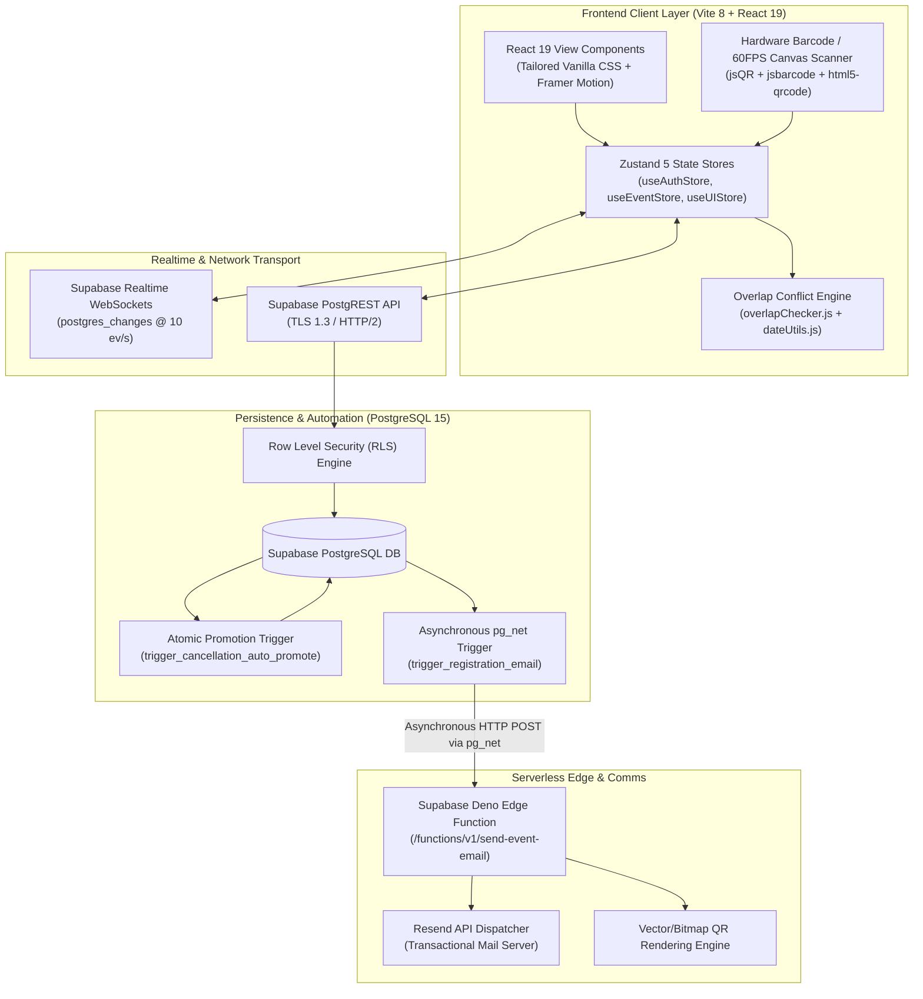

# 🏗️ VibeVenue Architecture & Design Rationale

> **Version:** `v0.93 (93 commits)`  
> **Target Environment:** High-throughput collegiate hackathons, academic conferences, technical symposiums, and sports tournaments.

---

## 1. Executive Architecture Overview

VibeVenue is built on a **modern reactive, decoupled architecture** that separates user interface rendering, client-side optimistic state coordination, transactional cloud database operations, asynchronous serverless event dispatch, and transactional email delivery.



---

## 2. Technology Stack & Framework Rationale

Every framework, library, and infrastructure choice in VibeVenue was deliberately selected to fulfill the demanding requirements of **zero-friction gate scanning, real-time multi-desk sync, sub-millisecond overlap checks, and high concurrency**.

### 2.1 Frontend Core: React 19 (`v19.2.8`) & Vite 8 (`v8.2.0`)
- **Why React 19?**
  - **Compiler Optimizations & Asset Preloading**: React 19 provides automatic memoization and faster reconciliation for complex SVG QR rendering, nested team rosters, and real-time data tables without boilerplate `useMemo` overhead.
  - **Action Transitions**: Smooth handling of optimistic form submissions during registration and attendance check-ins, ensuring the UI never stutters during network latency.
- **Why Vite 8?**
  - **Sub-Second Hot Module Replacement (HMR)**: Powered by Rollup and ES modules, enabling rapid iterative development.
  - **Ultra-Lean Production Bundling**: Treeshakes unused modules aggressively, producing compact JS chunks that load instantaneously even on spotty campus Wi-Fi networks.
  - **Why not Next.js?** VibeVenue is an interactive, authenticated single-page operations console and gate terminal. Server-side rendering (SSR) adds needless cold-start latency to gate scanner cameras and WebSocket channels. Client-side SPA execution delivers superior 60 FPS gate performance.

### 2.2 Routing: React Router v7 (`v7.18.2`)
- **Declarative Route Guarding**: Native client-side layout nesting (`Layout.jsx`, `GuardedRoute.jsx`) cleanly separates participant views (`/portal/*`) from restricted organizer desks (`/dashboard`, `/attendance`, `/scanner`, `/registrations`).
- **Deep Parameter Linking**: Dynamic route parameters (`/portal/register/:id`, `/registrations/:id`) allow instant direct linking for spot ticketing and delegate dossier verification.

### 2.3 State Management: Zustand 5 (`v5.0.15`)
- **Why Zustand instead of Redux Toolkit or Context API?**
  - **Zero Boilerplate & Tiny Footprint**: Zustand is under 1.2 kB, eliminating Redux action-creator and reducer bloat.
  - **Selective Re-rendering**: Allows scanner and attendance components to subscribe *only* to specific attendee slices without triggering cascade renders of entire event trees.
  - **Multi-Tab & Realtime Sync**: Zustand stores cleanly interface with Supabase Realtime WebSocket listeners outside of React component lifecycle trees.
  - **Transient Updates**: High-speed hardware barcode gun input streams update local buffers directly without stuttering the render thread.

### 2.4 Styling & Aesthetics: Vanilla CSS & Design Tokens (Zero Tailwind)
- **Why Vanilla CSS with Custom Design Tokens?**
  - **Design Sovereignty & Craftsmanship**: Standard Tailwind apps often look generic. VibeVenue implements a custom 2026-level glassmorphic design system using CSS custom properties (`var(--surface-dark)`, `var(--primary-glow)`, `var(--accent-cyan)`).
  - **Zero Build-Time CSS Purge Overhead**: Pure CSS avoids build-time utility class generation bugs and provides 100% predictable specificity.
  - **Hardware Accelerated Glassmorphism**: Utilizes native CSS `backdrop-filter: blur(20px)` and hardware-accelerated GPU transitions for fluid micro-interactions.

### 2.5 Realtime Database & Auth: Supabase (PostgreSQL 15 + Realtime Engine)
- **PostgreSQL Relational Robustness**: Academic events require strict relational integrity between events, ticket quotas, team rosters, pricing tiers, and attendee records. NoSQL databases (e.g., Firebase) lack atomic multi-row transactions required for waitlist queue promotion.
- **Supabase Realtime WebSockets (`postgres_changes`)**: Pushes database changes directly to open browser sessions in under 50ms, allowing 4 gate scanners to operate simultaneously without ticket collision.
- **Built-in Row Level Security (RLS)**: Protects student payment receipts and contact dossiers at the database engine level.

### 2.6 Serverless Edge Computing: Deno Edge Functions
- **V8 Isolate Startup (Sub-10ms)**: Unlike traditional AWS Lambda or Node.js containers that suffer from multi-second cold starts, Deno Edge Functions spin up in less than 10 milliseconds across global edge locations.
- **Native TypeScript & Web Standards**: Uses standard `fetch`, `Response`, and ESM modules without packaging nightmares.

### 2.7 Communication Engine: Resend API
- **Modern Transactional Email Standard**: Industry-leading inbox deliverability with automated SPF/DKIM authentication.
- **Dynamic HTML Gradient Inlining**: Renders responsive dark-mode gate passes with integrated QR codes directly within recipient email clients (Gmail, Apple Mail, Outlook).

### 2.8 Scanner Engine: `jsQR` + Canvas 2D + Hardware USB Barcode Listeners
- **Why Canvas 2D Frame Sampling instead of Native MediaTrack constraints?**
  - High-resolution mobile phone screens cause optical glare when presented to webcam lenses. VibeVenue’s Canvas 2D engine samples video frames at 60 FPS, applying dynamic luminance inversion (`attemptBoth: true`) to decode dark-mode screens, cracked phone protectors, and paper passes instantly.
- **Hardware USB Barcode Listener**: Intercepts physical USB HID barcode guns emitting raw keystroke sequences terminated by `Enter`, bypassing on-screen clicking entirely.

---

## 3. Directory Layout & Separation of Concerns

```
d:\Projects\Event Management Dashboard\
├── .env.example                     # Environment schema template
├── dist/                            # Production build output
├── docs/                            # Deep-dive modular technical documentation
│   ├── ARCHITECTURE.md              # Technical design & stack rationale (this file)
│   ├── BACKEND_SYSTEMS.md           # PostgreSQL triggers, DDL, and Edge functions
│   └── WORKFLOWS_AND_TESTING.md     # QA test suites, edge cases, and test scenarios
├── images/                          # High-resolution screenshots and screen recordings
│   ├── Email notification system/   # Actual email delivery receipts
│   ├── Prevent overlapping registrations/ # Conflict detection banners and toasts
│   ├── Registeration Deadline/      # Deadline & spot access configuration screenshots
│   ├── Waitlist and automatic promotion of people from waitlist/ # Waitlist telemetry
│   └── Check in Scanner.mp4         # 60FPS live gate scanning video recording
├── public/                          # Static assets and sample receipts
├── scripts/                         # Automation & database seed scripts
│   ├── seedAllCombinationsAndUsers.js # Comprehensive database seeder (10 events, 30 users)
│   ├── setup_email_trigger.js       # PostgreSQL pg_net trigger installation script
│   └── setup_waitlist_trigger.js    # PostgreSQL auto-promote trigger installation script
├── src/
│   ├── assets/                      # Brand assets, vectors, and imagery
│   ├── components/                  # Reusable UI component library
│   │   ├── common/                  # Logo, MarkdownRenderer, PassBarcodeQR
│   │   ├── dashboard/               # Metric StatCards, RegistrationChart, RecentRegistrations
│   │   ├── events/                  # EventCard, EventFilters
│   │   ├── forms/                   # EventForm (4-step multi-tier creation wizard)
│   │   ├── layout/                  # Sidebar, TopBar, GuardedRoute, Master Layout
│   │   ├── participants/            # ParticipantTable, RegistrationInspectModal
│   │   ├── profile/                 # EditProfileModal
│   │   └── ui/                      # Button, Modal, Badge, Toast, Spinner, SearchBar, Pagination
│   ├── data/                        # Static mock fallback definitions and constants
│   ├── lib/                         # Supabase client singleton & storage upload adapters
│   ├── pages/                       # Application route views
│   │   ├── AttendancePage.jsx       # Real-time delegate turnout & team roster check-in
│   │   ├── CheckInScannerPage.jsx   # 60FPS Camera & USB Barcode Gate Terminal
│   │   ├── DashboardPage.jsx        # Organizer analytics & revenue metrics
│   │   ├── EventDetailPage.jsx      # Public event overview, tracks, & speakers
│   │   ├── EventRegistrationPage.jsx # Multi-step candidate registration engine
│   │   ├── EventsPage.jsx           # Organizer event directory & catalog management
│   │   ├── LoginPage.jsx            # Secure student / admin credentials gateway
│   │   ├── ParticipantPortal.jsx    # Student pass wallet & live event catalogue
│   │   ├── RegistrationDetailPage.jsx # Attendee verification dossier & receipt desk
│   │   ├── RegistrationsPage.jsx    # Complete attendee ledger with search & CSV export
│   │   └── SettingsPage.jsx         # Platform customization & theme toggles
│   ├── services/
│   │   └── emailService.js          # Resend transactional email automation service
│   ├── store/                       # Zustand state stores
│   │   ├── useAuthStore.js          # Authentication, JWT session persistence, role elevation
│   │   ├── useEventStore.js         # Events, registrations, waitlist queuing, and realtime sync
│   │   └── useUIStore.js            # Global modals, theme state, and notification toasts
│   └── utils/                       # Pure utility modules
│       ├── audioUtils.js            # Low-latency synthesizers for gate chimes & alerts
│       ├── dateUtils.js             # Temporal window parsers, formatting, and status computation
│       ├── overlapChecker.js        # Mathematical interval collision detection algorithm
│       └── validators.js            # Input validation, phone/email sanitizers, roll number regex
├── supabase/
│   └── functions/
│       └── send-event-email/
│           └── index.ts             # Deno Edge Function handling 5 transactional email scenarios
├── test_accounts.csv                # Complete test account directory (3 admins, 30 students)
├── package.json                     # Dependency manifests and scripts
└── vite.config.js                   # Vite configuration
```

---

## 4. State Management Architecture

State is divided into three isolated, highly cohesive Zustand stores:

### 4.1 `useAuthStore`
- **Purpose**: Tracks active user session, profile metadata, role (`admin` vs `participant`), and college affiliations.
- **Persistence**: Automatically re-hydrates from `localStorage` and synchronizes with Supabase Auth state changes (`SIGNED_IN`, `SIGNED_OUT`, `TOKEN_REFRESHED`).
- **Role Elevation**: Automatically detects admin emails and grants administrative routing access.

### 4.2 `useEventStore`
- **Purpose**: Manages events catalog, registrations ledger, active pass wallet, capacity quotas, and waitlist queues.
- **Realtime Integration**: Subscribes to PostgreSQL changes (`*` on `events` and `registrations`). Any check-in at Gate 1 instantly updates the attendance ledger on Gate 2 without page refreshes.
- **Conflict Prevention**: Intercepts `registerForEvent` calls, running `detectRegistrationConflict()` against candidate event windows and existing user passes.

### 4.3 `useUIStore`
- **Purpose**: Controls global dialogs, toast notifications, search filters, and theme preferences.
- **Non-Blocking**: Keeps modal visibility decoupled from component data fetching.

---

## 5. Security & Elevation Model

1. **Database Row Level Security (RLS)**:
   - Participants can only query their own registrations and pass credentials.
   - Public event information is readable anonymously.
   - Administrative mutations (event creation, attendee status updates, spot pass creation) require verified organizer credentials.
2. **Admin Service Client Elevation**:
   - Background tasks (automatic waitlist promotion, attendance synchronization) run via a protected singleton client (`getAdminSupabaseClient`) that validates administrative privileges.
3. **Receipt & Proof Storage Protection**:
   - Attendee payment screenshots are stored in dedicated Supabase Storage buckets with randomized UUID file paths, preventing enumeration attacks.
