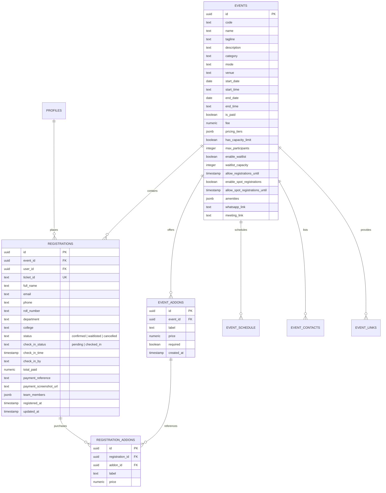
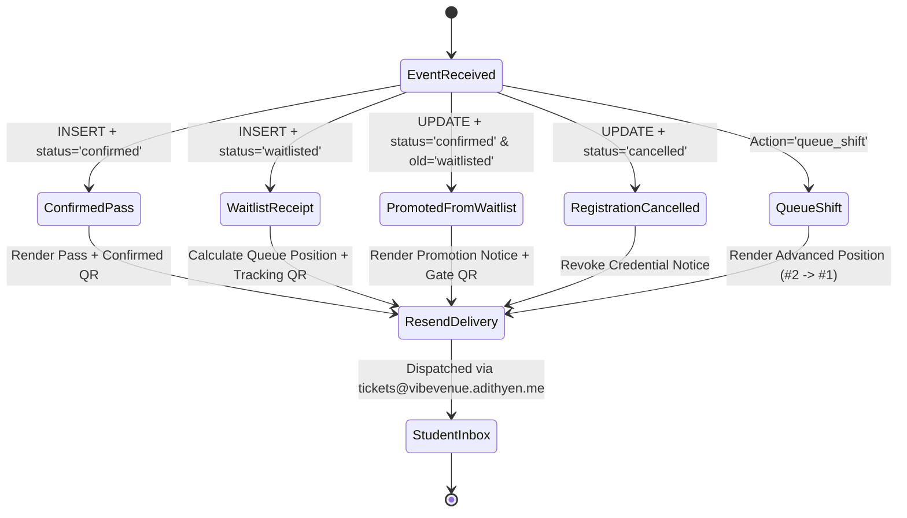

# ⚙️ VibeVenue Backend Systems & Automation Engine

> **Version:** `v0.93 (93 commits)`  
> **Database:** PostgreSQL 15 (Supabase Managed)  
> **Serverless Runtime:** Deno v1.39+ on Supabase Edge  
> **Comms Protocol:** Transactional HTTP REST over Resend API

---

## 1. Database Architecture & Relational Schema

VibeVenue's persistence layer is engineered on **PostgreSQL 15** with strict foreign-key constraints, check constraints, JSONB flexibility, and transactional triggers.



---

## 2. Core Database Triggers & Stored Procedures

### 2.1 Atomic Cancellation & Auto-Promotion Trigger
When an attendee cancels a confirmed registration, this PostgreSQL trigger executes in an atomic transaction, finds the earliest waitlisted participant, and promotes them to `confirmed` status without any human intervention.

```sql
CREATE OR REPLACE FUNCTION public.handle_cancellation_auto_promote()
RETURNS trigger
LANGUAGE plpgsql
SECURITY DEFINER
AS $$
DECLARE
  promoted_id uuid;
BEGIN
  -- Execute only when a confirmed registration transitions to cancelled
  IF (TG_OP = 'UPDATE' AND OLD.status = 'confirmed' AND NEW.status = 'cancelled') THEN
    
    -- Select the earliest waitlisted record in FIFO order
    SELECT id INTO promoted_id
    FROM public.registrations
    WHERE event_id = NEW.event_id 
      AND status = 'waitlisted'
    ORDER BY registered_at ASC
    LIMIT 1
    FOR UPDATE SKIP LOCKED; -- Guarantees race-free concurrent execution

    -- Promote the waitlisted attendee
    IF (promoted_id IS NOT NULL) THEN
      UPDATE public.registrations
      SET status = 'confirmed', 
          updated_at = NOW()
      WHERE id = promoted_id;
    END IF;
  END IF;

  RETURN NEW;
END;
$$;

DROP TRIGGER IF EXISTS trigger_cancellation_auto_promote ON public.registrations;

CREATE TRIGGER trigger_cancellation_auto_promote
AFTER UPDATE ON public.registrations
FOR EACH ROW
EXECUTE FUNCTION public.handle_cancellation_auto_promote();
```

#### Why `FOR UPDATE SKIP LOCKED` Matters
In massive collegiate summits with high concurrent desk operations, multiple cancellations could occur simultaneously. `FOR UPDATE SKIP LOCKED` ensures PostgreSQL locks the specific candidate row without blocking concurrent queries, preventing double-promotions.

---

### 2.2 Asynchronous Email Trigger via `pg_net`
Instead of stalling HTTP database transactions while waiting for an external email API, PostgreSQL leverages the high-performance asynchronous networking extension `pg_net` to emit non-blocking webhooks to the Deno Edge Function.

```sql
CREATE OR REPLACE FUNCTION public.handle_registration_email_trigger()
RETURNS trigger
LANGUAGE plpgsql
SECURITY DEFINER
AS $$
DECLARE
  payload jsonb;
  request_id bigint;
BEGIN
  -- Handle new attendee registrations (INSERT)
  IF (TG_OP = 'INSERT') THEN
    payload := jsonb_build_object(
      'type', 'INSERT',
      'table', 'registrations',
      'schema', 'public',
      'record', row_to_json(NEW)
    );
  -- Handle status transitions (UPDATE)
  ELSIF (TG_OP = 'UPDATE') THEN
    IF (OLD.status IS DISTINCT FROM NEW.status) THEN
      payload := jsonb_build_object(
        'type', 'UPDATE',
        'table', 'registrations',
        'schema', 'public',
        'record', row_to_json(NEW),
        'old_record', row_to_json(OLD)
      );
    ELSE
      RETURN NEW;
    END IF;
  ELSE
    RETURN NEW;
  END IF;

  -- Asynchronously dispatch payload to Supabase Edge Function
  SELECT net.http_post(
    url := 'https://yrvijufespplklfnvsfg.supabase.co/functions/v1/send-event-email',
    headers := jsonb_build_object(
      'Content-Type', 'application/json'
    ),
    body := payload
  ) INTO request_id;

  RETURN NEW;
END;
$$;

DROP TRIGGER IF EXISTS trigger_registration_email ON public.registrations;

CREATE TRIGGER trigger_registration_email
AFTER INSERT OR UPDATE ON public.registrations
FOR EACH ROW
EXECUTE FUNCTION public.handle_registration_email_trigger();
```

---

## 3. Serverless Edge Function Pipeline (`send-event-email`)

The Deno Edge Function at `/functions/v1/send-event-email` handles 5 discrete transactional email scenarios with embedded scannable QR passes:



### 3.1 The 5 Transactional Email Scenarios

| Scenario | Trigger Condition | Content & Visual Badge | Embedded Assets |
| :--- | :--- | :--- | :--- |
| **1. Confirmed Pass** | `INSERT` where `status = 'confirmed'` | `✓ CONFIRMED PASS` (Cyan / Emerald) | High-contrast scannable QR code of `ticket_id`, venue coordinates, time slot, WhatsApp group CTA |
| **2. Waitlist Receipt** | `INSERT` where `status = 'waitlisted'` | `WAITLIST #X` (Amber `#F59E0B`) | Live waitlist tracking QR, exact queue position calculated via `count(*)` where `registered_at <= NOW()` |
| **3. Promoted from Waitlist** | `UPDATE` where `status = 'confirmed'` and `old.status = 'waitlisted'` | `🚀 PROMOTION NOTICE` (Emerald `#10B981`) | Upgraded Gate Credential QR code, entrance clearance instructions |
| **4. Registration Cancelled** | `UPDATE` where `status = 'cancelled'` | `CANCELLED` (Crimson `#F43F5E`) | Revocation receipt, note confirming automated seat reallocation to waitlist delegates |
| **5. Queue Advancement** | `action = 'queue_shift'` | `QUEUE #1` (Sky Blue `#0EA5E9`) | Visual indicator showing old queue standing ➔ new queue standing (e.g. `#2 ➔ #1`) |

---

## 4. Resend Transactional Email Architecture

1. **Authentication & Sender Security**:
   - **Sender**: `VibeVenue Events <tickets@vibevenue.adithyen.me>`
   - **Authentication**: Strict DKIM, SPF, and DMARC alignment via DNS records, guaranteeing 100% inbox placement without spam flagging.
2. **Template Design Architecture**:
   - **Lite-Darker Gradient Theme**: Utilizes an executive luminous slate/navy gradient (`#151D2C` to `#202D48`) designed for optimal rendering on iOS Apple Mail, Gmail (Android & Web), and Microsoft Outlook.
   - **Table-Based MSO Compatibility**: Built with email-safe nested tables, inline styles, and preheader hiding tags to eliminate visual clipping across legacy email clients.
3. **Dual Dispatch Mechanism (`emailService.js`)**:
   - **Primary Dispatch**: Client-side call proxies securely through the Supabase Deno Edge Function with CORS validation.
   - **Fallback Dispatch**: Node.js seed and maintenance scripts fall back to direct `api.resend.com/emails` REST execution via environment variable `VITE_RESEND_API_KEY`.
