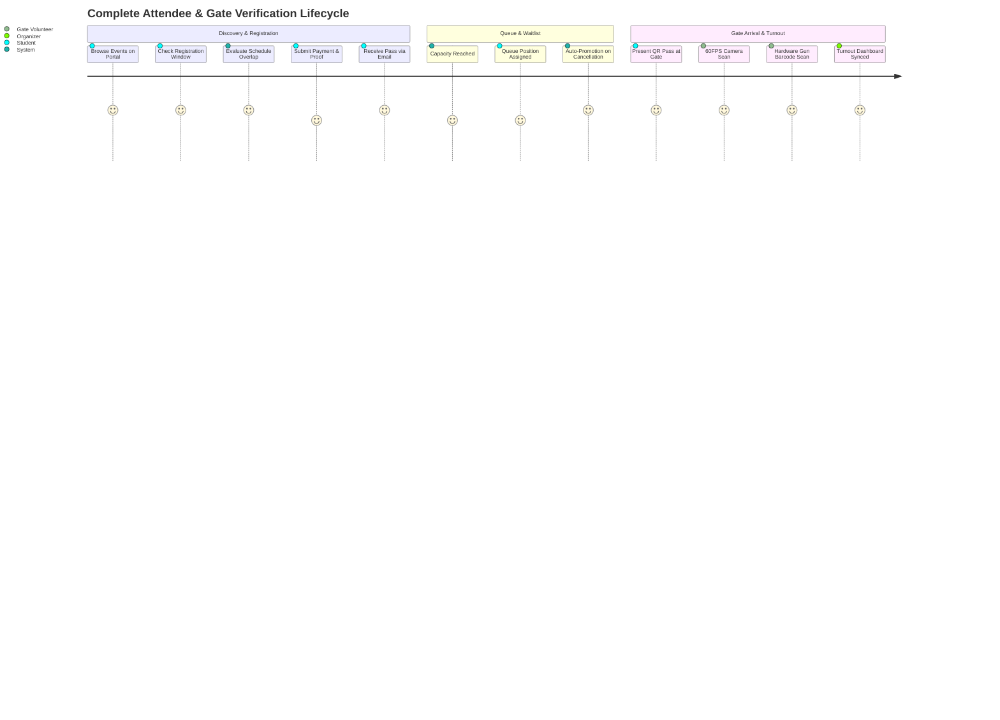

# 🧪 VibeVenue Workflows & Verification Testing Matrix

> **Version:** `v0.98 (98 commits)`  
> **Environment:** Staging & Production (`https://vibe-venue.vercel.app`)  
> **Target Audience:** Lead Organizers, QA Engineers, Gate Volunteers, and Technical Evaluators

---

## 1. Test Credentials Directory

### 1.1 👑 3 Admin & Organizer Portals
| Account Title | Email Address | Password | Role & Clearance Level |
| :--- | :--- | :--- | :--- |
| **Lead Organizer Admin** | `organizer.admin@vibevenue.tech` | `VibeVenueAdmin#2026` | Root Organizer Clearance, Event Creation Wizard, Financial Dossier Approval, Gate Scanning Terminal |
| **CSI Staff Lead & Admin** | `csi.lead@vibevenue.tech` | `CSIAdmin#2026` | CSI Operations Lead, Event Management, Turnout Monitoring, Emergency Spot Pass Desk |
| **Academic Organizer Admin** | `organizer@sct.edu` | `VibeVenueAdmin#2026` | Academic Liaison, Schedule & Venue Oversight, Attendance Audits |

### 1.2 👥 10 Pre-Seeded Student / Participant Test Accounts
All accounts are provisioned with the standard password: **`VibeVenue#2026`**

| ID | Full Name | Email Address | Roll Number | Department & Year | College Affiliation |
| :---: | :--- | :--- | :--- | :--- | :--- |
| **01** | **Aarav Nair** | `test.student01@vibevenue.tech` | `SCT24CS00` | Computer Science & Eng. (1st Year) | SCT College of Engineering |
| **02** | **Diya Ramesh** | `test.student02@vibevenue.tech` | `SCT24CS01` | CSE(AI&ML) (2nd Year) | College of Engineering Trivandrum |
| **03** | **Aditya Menon** | `test.student03@vibevenue.tech` | `SCT24CS02` | Electronics & Comm. (3rd Year) | Model Engineering College |
| **04** | **Kavya S** | `test.student04@vibevenue.tech` | `SCT24CS03` | Mechanical Eng. (4th Year) | Mar Athanasius College |
| **05** | **Rohan Varma** | `test.student05@vibevenue.tech` | `SCT24CS04` | Information Tech. (1st Year) | SCT College of Engineering |
| **06** | **Sneha Pillai** | `test.student06@vibevenue.tech` | `SCT24CS05` | Computer Science & Eng. (2nd Year) | College of Engineering Trivandrum |
| **07** | **Arjun Krishna** | `test.student07@vibevenue.tech` | `SCT24CS06` | CSE(AI&ML) (3rd Year) | Model Engineering College |
| **08** | **Meera Nambiar** | `test.student08@vibevenue.tech` | `SCT24CS07` | Electronics & Comm. (4th Year) | Mar Athanasius College |
| **09** | **Vishnu Prasad** | `test.student09@vibevenue.tech` | `SCT24CS08` | Mechanical Eng. (1st Year) | SCT College of Engineering |
| **10** | **Ananya Suresh** | `test.student10@vibevenue.tech` | `SCT24CS09` | Information Tech. (2nd Year) | College of Engineering Trivandrum |

---

## 2. Exhaustive Step-by-Step Workflow Test Suites

---

### 🧪 Test 1: Individual Delegate Registration & Digital Pass Issuance
- **Persona:** Student (`test.student01@vibevenue.tech`)
- **Objective:** Verify frictionless checkout, dynamic UPI generation, payment proof upload, and instant digital pass wallet rendering.
- **Video Walkthrough:** [📹 Registeration and email confirmations.mp4](../images1/Registeration%20and%20email%20confirmations.mp4)
- **Procedure:**
  1. Open `https://vibe-venue.vercel.app/login` and log in as `test.student01@vibevenue.tech`.
  2. In the **Participant Portal**, locate **PromptX: Enterprise GenAI, LLMOps & RAG Architecture Masterclass**.
  3. Click **"Register Now"**.
  4. Step 1 (Personal Details) is auto-populated with Aarav Nair's profile. Verify phone and college, then click **"Proceed to Step 2"**.
  5. Step 2 displays the dynamically generated UPI QR code for `adityenh@oksbi` with pre-filled amount (Free or Tier Fee). Enter reference `TXN-PROMPTX-01` and upload a payment proof screenshot.
  6. Click **"Confirm Registration & Generate Pass"**.
- **Expected Result:**
  - Registration is confirmed.
  - Step 3 renders the **Confirmed Pass** card with a scannable QR code and unique `TCK-XXXXXX` code.
  - An email with subject `🎟️ Pass Confirmed: PromptX...` is dispatched with embedded QR pass.

---

### 🧪 Test 2: Team Roster Registration Engine (Min / Max Squad Rules)
- **Persona:** Student (`test.student02@vibevenue.tech` — Diya Ramesh)
- **Objective:** Validate squad bounds, dynamic member fields, and composite ticket issuance.
- **Procedure:**
  1. Navigate to **HACKVERSE '26** (2–4 Member Team Pass).
  2. Click **"Register Team"**.
  3. Enter Team Name `CyberVanguard`.
  4. Notice Diya is automatically locked as **Team Leader**.
  5. Click **"+ Add Team Member"** twice. Add:
     - Member 2: `Aditya Menon` (`test.student03@vibevenue.tech`)
     - Member 3: `Kavya S` (`test.student04@vibevenue.tech`)
  6. Attempt to add a 5th member — verify the button is disabled or alerts that maximum team size is 4.
  7. Proceed through payment verification and confirm.
- **Expected Result:**
  - Team pass is created. All members are stored in `registrations.team_members` JSONB column.
  - Digital pass indicates `CyberVanguard (3 Members)`.

---

### 🧪 Test 3: Prevent Overlapping Registrations (Temporal Collision)
- **Persona:** Student (`test.student01@vibevenue.tech` — Aarav Nair)
- **Objective:** Verify the mathematical interval collision algorithm prevents double-booking across simultaneous tracks.
- **Procedure:**
  1. Ensure Aarav is already registered for an event on **08 Sep 2026, 07:00 PM – 09:30 PM**.
  2. In the portal, locate another event occurring on **08 Sep 2026, 08:00 PM – 10:00 PM** (e.g., competing workshop).
  3. Click **"Register Now"**.
- **Expected Result:**
  - The UI immediately intercepts the action and displays a prominent **⚠️ Scheduling Conflict** modal/toast banner:
    > *"You're already registered for [Event A] which runs 8 Sep 2026, 7:00 PM – 9:30 PM — this overlaps with [Candidate Event]. Cancel that registration first if you'd like to switch."*
  - The registration form does NOT proceed, preventing double booking.

---

### 🧪 Test 4: Capacity Limit & Waitlist Queuing (Queue Positions #1 & #2)
- **Persona:** Students 5 & 6 (`test.student05@vibevenue.tech` and `test.student06@vibevenue.tech`)
- **Objective:** Verify that when regular seat quota is filled, the system transitions to waitlist mode and assigns sequential queue numbers.
- **Video Walkthrough:** [📹 confirmed and waiting list registerations.mp4](../images1/confirmed%20and%20waiting%20list%20registerations.mp4)
- **Procedure:**
  1. Configure an event with `max_participants = 10` and `enable_waitlist = true`.
  2. Have users fill the 10 available seats.
  3. Log in as Rohan Varma (`test.student05@vibevenue.tech`). The event card badge now shows **`Waitlist Open (#1)`**.
  4. Complete the registration form.
- **Expected Result:**
  - Rohan receives a **Waitlist Pass** with badge **`WAITLISTED (#1)`** and ticket code `TCK-WAIT-01`.
  - Rohan's inbox receives: `📋 Waiting List Confirmation: [Event] (Position #1)`.
  - Next user (Sneha Pillai) registering sees **`Waitlist Open (#2)`** and receives queue position `#2`.

---

### 🧪 Test 5: Registration Cancellation & Atomic Auto-Promotion
- **Persona:** Confirmed Attendee + Waitlist #1 Attendee
- **Objective:** Verify that when a confirmed delegate cancels, PostgreSQL trigger `trigger_cancellation_auto_promote` instantly upgrades Waitlist #1 to Confirmed without human latency.
- **Video Walkthrough:** [📹 waitlist list updates and upgrade againts cancellations.mp4](../images1/waitlist%20list%20updates%20and%20upgrade%20againts%20cancellations.mp4)
- **Procedure:**
  1. Log in as the confirmed participant from Test 4.
  2. In **My Digital Passes**, click **"Cancel Registration"** and confirm.
  3. Immediately log in as Rohan Varma (`test.student05@vibevenue.tech`).
- **Expected Result:**
  - The cancelling user receives an email: `❌ Registration Cancelled`.
  - Rohan's pass in the Student Portal changes from `WAITLISTED (#1)` to **`✓ CONFIRMED GATE PASS`**.
  - Rohan receives an email: `🚀 Great News! You're Confirmed for [Event] (TCK-WAIT-01)` with a newly activated entrance QR code.

---

### 🧪 Test 6: Queue Position Advancement Notification (#2 ➔ #1)
- **Persona:** Sneha Pillai (`test.student06@vibevenue.tech` — Waitlist #2)
- **Objective:** Verify queue progression notification when the person ahead is promoted.
- **Video Walkthrough:** [📹 waitlist list updates and upgrade againts cancellations.mp4](../images1/waitlist%20list%20updates%20and%20upgrade%20againts%20cancellations.mp4)
- **Procedure:**
  1. Check Sneha's email inbox following the cancellation in Test 5.
- **Expected Result:**
  - Sneha receives: `📈 Queue Update: Advanced to #1 for [Event]`.
  - Email displays: `Position #2 ➔ Position #1` with updated tracking QR badge.

---

### 🧪 Test 7: Ultra-Fast 60FPS Camera Gate Scanner Check-In
- **Persona:** Gate Volunteer / Admin (`organizer.admin@vibevenue.tech`)
- **Objective:** Verify 60FPS canvas frame grabber and dynamic team gate modal.
- **Video Walkthrough:** [📹 Check in Scanner.mp4](../images/Check%20in%20Scanner.mp4)
- **Procedure:**
  1. Open `https://vibe-venue.vercel.app/scanner`.
  2. Grant webcam permission.
  3. Present a confirmed delegate pass QR code to the camera.
  4. For individual passes, verify instant green confirmation chip, audible chime, and immediate attendance record update.
  5. For team passes, verify the **Team Gate Clearance Modal** pops up with individual checkboxes for each squad member. Check all and click **"Confirm Gate Check-In"**.
- **Expected Result:**
  - Check-in latency is sub-100ms.
  - Audio chime sounds.
  - Attendee is stamped `checked_in` with timestamp in PostgreSQL.

---

### 🧪 Test 8: Physical USB Barcode Scanner Check-In (Keystroke Emulation)
- **Persona:** Gate Volunteer using hardware USB scanner
- **Objective:** Verify seamless hardware barcode scanner input without touching mouse or focus inputs.
- **Procedure:**
  1. On `/scanner`, plug in a USB handheld barcode reader.
  2. Notice the indicator pill displays: `⚡ BARCODE READER DETECTED`.
  3. Scan a printed badge barcode.
- **Expected Result:**
  - The raw barcode sequence is intercepted, validated, and checked in instantly.

---

### 🧪 Test 9: Turnout Matrix, Roster Inspection & Spot Walk-In Pass Issuance
- **Persona:** Admin (`csi.lead@vibevenue.tech`)
- **Objective:** Verify real-time gate metrics and on-desk emergency registration.
- **Visual Evidence:**
  
  .png)
- **Procedure:**
  1. Open `https://vibe-venue.vercel.app/attendance`.
  2. Inspect the 4 interactive stat cards: **TOTAL DELEGATES**, **PRESENT**, **ABSENT**, and **TEAMS**.
  3. Click **"Issue Spot Pass"**.
  4. Enter walk-in attendee: `Govind K`, Roll Number `SCT24EC99`, Fee collected `₹100`.
  5. Click **"⚡ Issue Spot Pass & Print Badge"**.
- **Expected Result:**
  - Spot pass is generated and automatically checked in.
  - Turnout count increments by 1 in real time.

---

### 🧪 Test 10: Attendee Verification Dossier & Receipt Desk
- **Persona:** Finance / Verification Desk Admin
- **Objective:** Audit payment screenshots and manage add-ons distribution.
- **Visual Evidence:**

  .png)
- **Procedure:**
  1. Open `https://vibe-venue.vercel.app/registrations`.
  2. Click on any attendee row to view their dossier.
  3. Click on the payment screenshot thumbnail to open the high-res zoom modal.
  4. In the **Add-ons Distribution Checklist**, toggle `Official Hoodie` and `Badge Kit` to `Distributed`.
- **Expected Result:**
  - Verification state persists in Supabase.
  - Distribution timestamps are logged for desk accountability.

---

### 🧪 Test 11: 1-Click Turnout & Registrations CSV Export
- **Persona:** Event Operations & Audit Lead
- **Objective:** Verify client-side CSV generator compiling delegate rosters with UTF-8 BOM encoding and standardized ISO timestamped filenames.
- **Video Walkthrough:** [📹 csv export.mp4](../images1/csv%20export.mp4)
- **Visual Evidence:**

  .png)
- **Procedure:**
  1. Open `https://vibe-venue.vercel.app/registrations`.
  2. Filter by status or select an event (or keep `All Events`).
  3. Click the **"Export CSV"** button located at the top right of the registrations table.
  4. Verify the browser triggers an instant direct file download.
  5. Open the downloaded file (`vibevenue_registrations_YYYY-MM-DD.csv`) in Excel or Google Sheets.
- **Expected Result:**
  - File downloads instantaneously with `.csv` extension.
  - Characters are encoded with UTF-8 BOM (`\uFEFF`), preventing Excel character distortion.
  - Columns exported: Ticket ID, Full Name, Email, Phone, College, Roll Number, Event Code, Event Name, Registration Type, Status, Payment Status, Amount Paid, Check-in Status, and Registration Timestamp.

